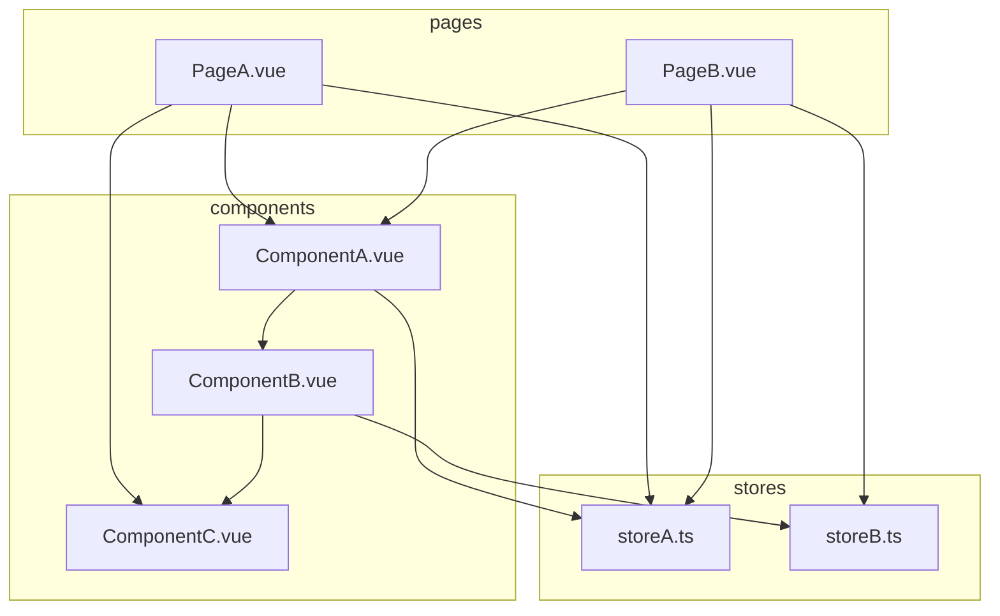

# Reduce Use Of Pinia

---
layout: statement
---

---

## Problems with this approach

- Stores are acting like global variables
  - Harder to test due to tight coupling
  - Harder to understand data flow
- Stores are quite large, which is increasing the risk of violating SRP
- Components are are less reusable due to depending on specific stores
- Some state shouldnt be shared globally
- Mocks everywhere in component tests

---

## Proposed Approach

- **stores**
  - used only when state needs to be shared across multiple components or pages
- **pages**
  - responsible for orchestrating data
  - in most cases this will be the top level of data orchestration (unless a store is necessary)
- **composables**
  - responsible for encapsulating reusable stateful logic
  - can be used by both pages and components
  - can be used as helpers for data orchestration in pages
  - can be used for encapsulating complex logic in components
- **components**
  - responsible for presentation and UI logic
  - should define props and emits to communicate with parent components or pages
